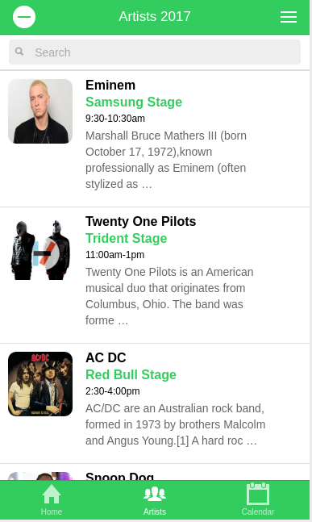
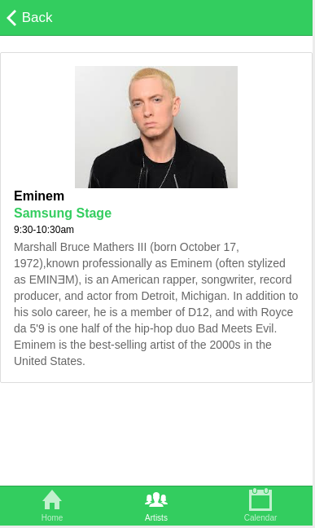

## Ionic Multi Tab App Template

This project is a simple template of a multi tab application developed using Ionic.

This project is based in my other Ionic [project](https://github.com/coderade/ionic-single-view-template).

In this application you can search, reorder and delete the attractions.

### Screens

##### Home

##### Artists

##### Artist Detail

##### Schedule

### How to use

Download and install the Node.Js using the [NVM](https://github.com/creationix/nvm).

Install the [yarn](https://yarnpkg.com/en/) following the official 
[documentation](https://yarnpkg.com/lang/en/docs/install/#linux-tab).

Clone the repository and install the node modules.

`yarn install`

Install the Bower globally:

`yarn global add bower`

Install the Ionic globally:

`yarn global add ionic`

Install the Bower components:

`bower install`

After this, you can run the application.

***

#### Running the application

You can use the Ionic to serve this application.

To do this on the root of the project use the `ionic serve` command.

Then navigate your browser to http://192.168.25.110:8100 to see the app running in your browser.

#### About Ionic

For more information on Ionic please check out [IONIC](http://ionicframework.com/).
